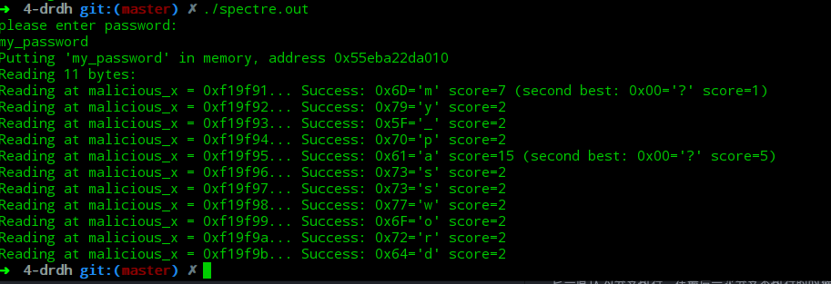

# Spectre 攻击报告
### 环境
- 环境一
  - Ubuntu 7.2.0
  - linux veision 4.13.0-38-generic
  - gcc version 7.2.0
- 环境二
  - Deepin 4.14.12-2 (2018-01-06)
  - gcc version 6.3.0 20170321 (Debian 6.3.0-11)

### 代码说明
代码是对论文《Spectre Attacks: Exploiting Speculative Execution》中代码的修改与加强。[参考代码](https://github.com/Eugnis/spectre-attack)

函数readMemoryByte来自该论文，针对本机做了如下修改：
- CHCHE_HIT_THRESHOLD调整为80
- PAGE_SIZE调整为4096

### 使用
原论文是对一段固定字符串进行非法窃取，理论上可以对在内存的所有内容进行窃取。

-  编译`make`
-  对用户输入密码非法窃取(此时不带参数)：
```
$ ./spectre.out
please enter password:
my_password
```
输出效果



可以看到均显示为`success`，内容为`"my_password"`

- 窃取指定内存地址的内容
```
$ ./spectre.out address length
```


### 原理
系统会预测分支执行，但是分支内容可能涉及到无效的内存访问，如果能够多次训练预测器，让它一直认为分支执行，在最后一次分支不执行的时候，将无效的内存信息与地址写进cache，此时可以通过比较cache的访问速度来判断此内容是否已在cache里面。
多次调用victim_function, 前5次为正确的范围，最后一次为攻击的目的地址，当CPU意识到需要回转到未执行分支的状态的时候，窃取的内容已经填充到了cache中，此时只需要比较时间，确定某个特定位置是否是hit来确定是否已窃取到值，发现窃取到值之后，就可以记录，多次对同一位置执行，可以得到准确率。反复执行可以得到全部的内容。

详细解释：
- 循环TRIES次
  - 清空array2[i*PAGE_NUM]的cache,i=0...255
  - 清空array1_size的cache
  - 执行受害者函数
    - 5次正确分支，紧接着一次失败分支，在这次失败的分支时候使用目标地址
    - if需要使用array1_size值，cache缺失，先执行`temp &= array2[array1[x] * PAGE_SIZE];`x为目的地址相对于array1起始位置的偏移，分支失败时，array2的cache对应ascci码数字位置已经在cache中
  - 依次试探cache，执行时间短的便是数据
